# 🔄 Recursion in Java

A beginner-friendly Java practice repository focused on learning **recursion** through small programming problems involving numbers, searching, strings, arrays, and mathematical calculations.

## 🗺️ Repository Overview

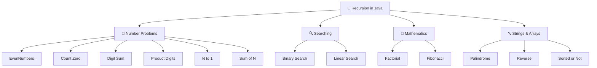

## 📂 Repository Structure

```text
Recurison-in-Java/
│
├── src/
│   ├── BSinRecurison.java
│   ├── EvenNumbers.java
│   ├── Fibonacci.java
│   ├── LSonMultipleTar.java
│   ├── countzero.java
│   ├── digitsum.java
│   ├── factorial.java
│   ├── linearSerach.java
│   ├── nto1numbers.java
│   ├── palindrome.java
│   ├── productdigits.java
│   ├── recurisonExample.java
│   ├── reverse.java
│   ├── sortedorNot.java
│   └── sumofNno.java
│
├── .gitignore
└── README.md
```

The repository currently has these 15 Java source files inside `src`, along with `.gitignore` and `README.md`. citeturn1view0turn0view0

## 🧠 What Is Recursion?

Recursion is a technique where a method calls itself to solve a smaller version of a problem.

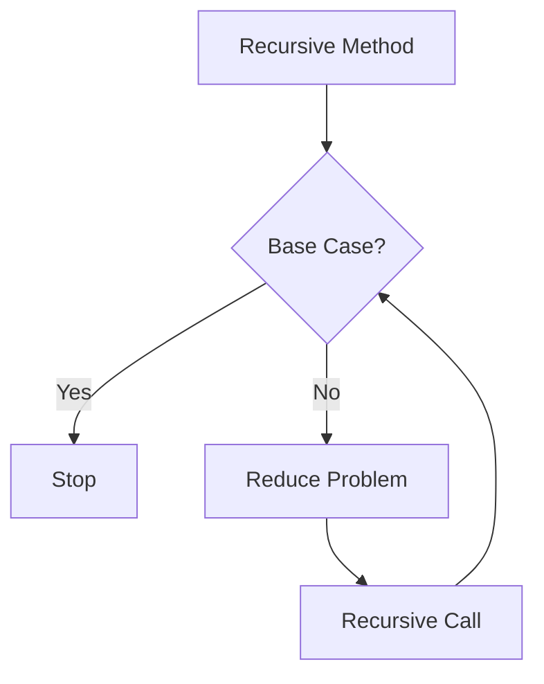

Every recursive solution should have:

| Concept | Purpose |
|---|---|
| Base Case | Stops recursion |
| Recursive Case | Solves a smaller problem |
| Progress | Moves toward the base case |
| Call Stack | Stores active recursive calls |

---

# 📚 Programs

## `recurisonExample.java`

Basic recursion practice for understanding how a method calls itself.

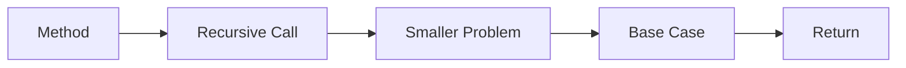

## `factorial.java`

Calculates factorial recursively.

```text
5! = 5 × 4 × 3 × 2 × 1
```

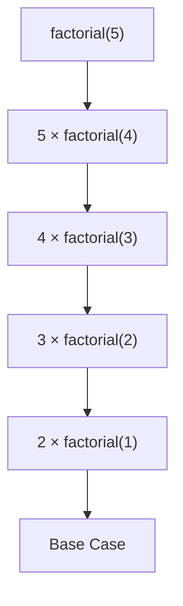

## `Fibonacci.java`

Practices the Fibonacci sequence recursively.

```text
0 1 1 2 3 5 8 ...
```

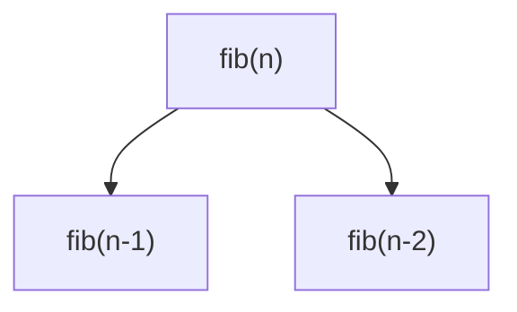

## `digitsum.java`

Practices finding the sum of digits recursively.

```text
1234 → 1 + 2 + 3 + 4
```

## `productdigits.java`

Practices finding the product of digits recursively.

```text
1234 → 1 × 2 × 3 × 4
```

## `countzero.java`

Practices recursively counting zero digits.

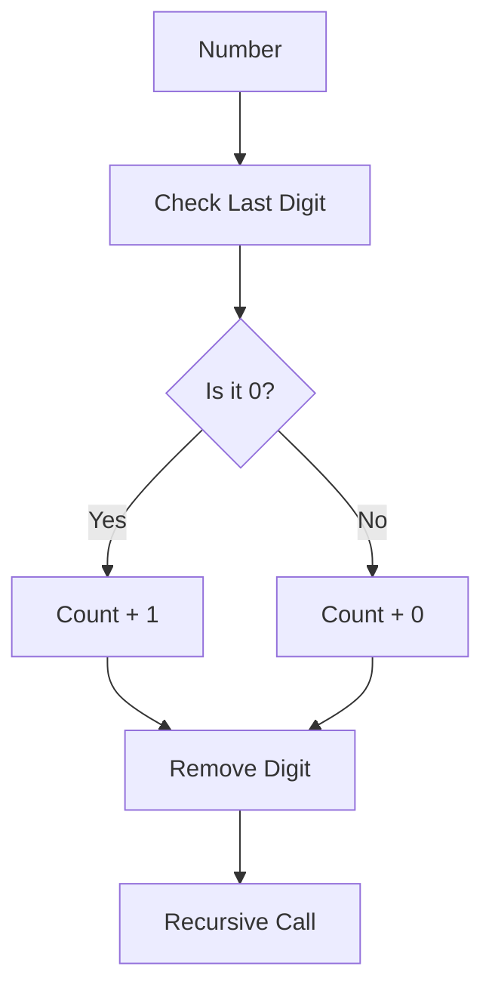

## `nto1numbers.java`

Practices printing numbers from `N` down to `1`.

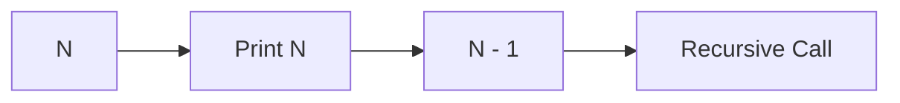

## `sumofNno.java`

Practices calculating:

```text
1 + 2 + 3 + ... + N
```

A common recursive idea is:

```text
sum(n) = n + sum(n - 1)
```

---

# 🔍 Searching

## `BSinRecurison.java`

Binary Search using recursion.

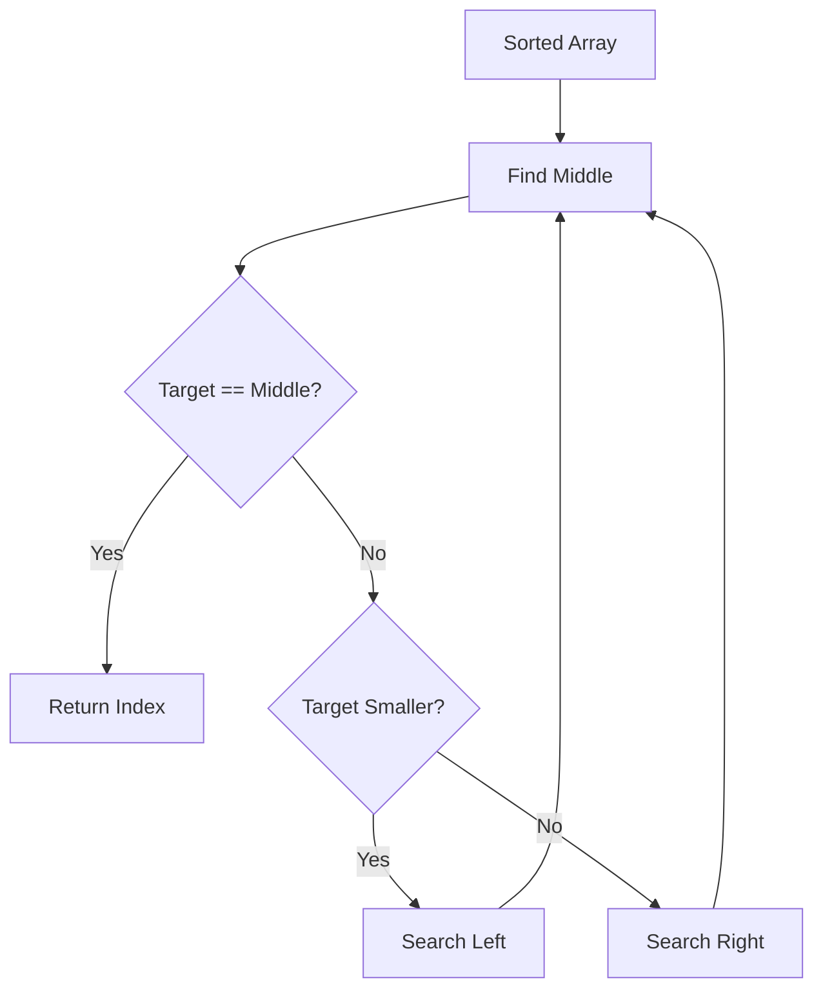

**Complexity:**

```text
Time:  O(log n)
Space: O(log n)
```

## `linearSerach.java`

Linear Search using recursive calls.

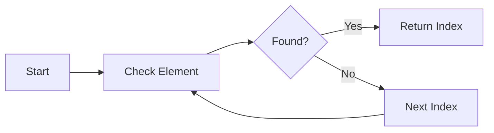

**Complexity:**

```text
Time:  O(n)
Space: O(n)
```

## `LSonMultipleTar.java`

A recursive linear-search practice program for working with multiple target/search conditions.

---

# 🔤 Strings & Arrays

## `palindrome.java`

Practices checking whether a value reads the same forward and backward.

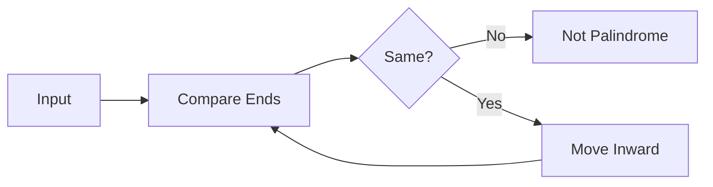

## `reverse.java`

Practices reversing data using recursive calls.

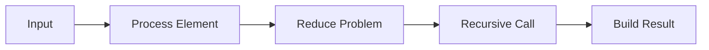

## `sortedorNot.java`

Practices checking whether elements are sorted recursively.

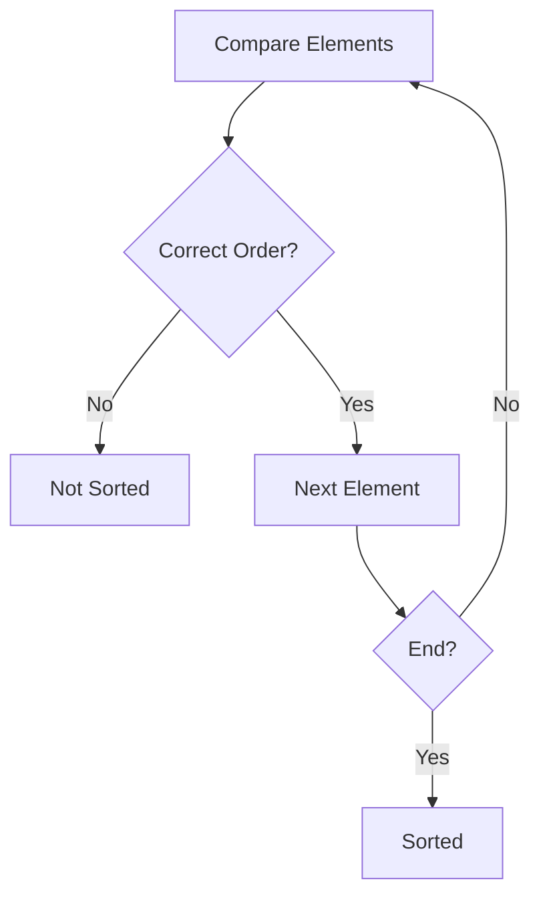

## `EvenNumbers.java`

Additional recursion practice involving even-number processing.

---

# 📊 Program Categories

| Category | Programs |
|---|---|
| Recursion Basics | `recurisonExample.java` |
| Mathematics | `factorial.java`, `Fibonacci.java`, `digitsum.java`, `productdigits.java`, `sumofNno.java` |
| Number Processing | `EvenNumbers.java`, `countzero.java`, `nto1numbers.java` |
| Searching | `BSinRecurison.java`, `linearSerach.java`, `LSonMultipleTar.java` |
| Strings / Sequences | `palindrome.java`, `reverse.java`, `sortedorNot.java` |

## 🔄 Learning Progression

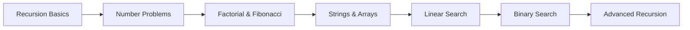

## 🧩 General Recursion Pattern

```java
returnType method(parameters) {

    // Base Case
    if (condition) {
        return result;
    }

    // Recursive Case
    return method(smallerProblem);
}
```

Think of recursion as:

```text
Large Problem
     ↓
Smaller Problem
     ↓
Smaller Problem
     ↓
Base Case
     ↓
Return Results
```

## 🛠️ Technologies

- Java
- JDK
- IntelliJ IDEA / VS Code / Eclipse
- Git
- GitHub

## 🚀 How to Run

Clone the repository:

```bash
git clone https://github.com/Betha-hemanth/Recurison-in-Java.git
cd Recurison-in-Java
```

Compile an individual Java file:

```bash
javac src/factorial.java
```

Then run the compiled class from the appropriate classpath:

```bash
java -cp src factorial
```

You can also open the repository directly in IntelliJ IDEA, Eclipse, or VS Code.

## 🎯 Learning Goals

- Understand recursive thinking
- Identify base cases
- Build recursive cases
- Understand the call stack
- Solve mathematical problems recursively
- Search recursively
- Process strings and arrays
- Analyze time and space complexity
- Improve problem-solving skills

## 🔮 Future Topics

Possible additions:

- Recursive sorting
- Merge Sort
- Quick Sort
- Array recursion
- String recursion
- Backtracking
- Subsets
- Permutations
- Tower of Hanoi
- Maze solving
- N-Queens

## 👨‍💻 Author

**Betha Hemanth**

Java & DSA Practice

⭐ If this repository helps you learn recursion in Java, consider giving it a star!
